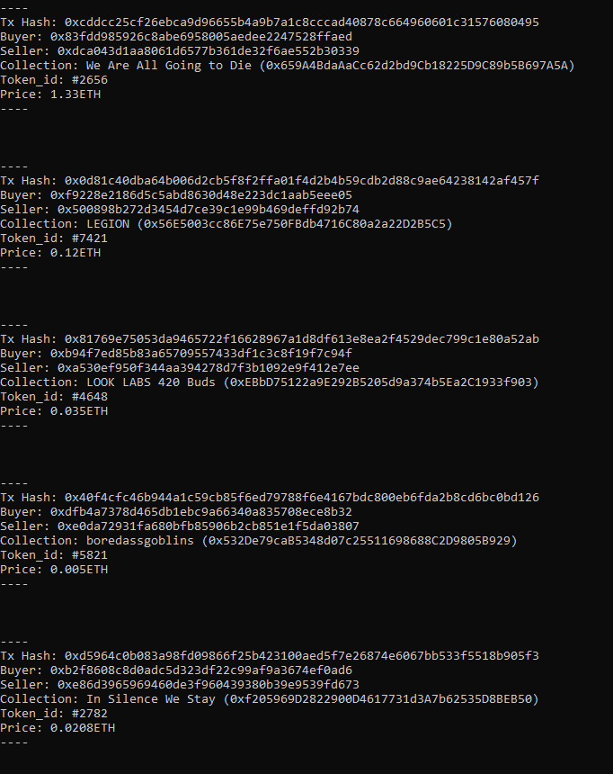

# Web3 scripts made while helping people

> It's my first time sharing code on GitHub, don't hate if it's a bit messy <3

| Script        | Description           | File(s)  |
| ------------- |-------------| -----|
| OpenSea Sales | Example on how to monitor latest sales on OpenSea using web.py. ERC1150 are not printed. | [opensea_sales.py](opensea_sales.py) |

### OpenSea sales

Well, it's a simple script which connects to a RPC provider with HTTP or IPC (**needs edits in the code to setup the provider**) and then prints each ERC721 sale occuring on OpenSea by listening to the Wyvern contract.

Here's a nice image:

