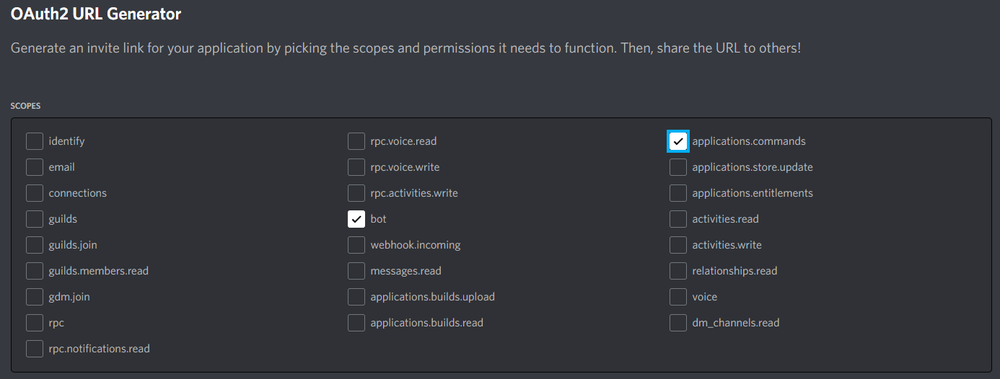
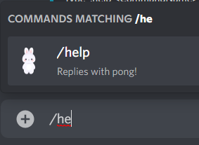
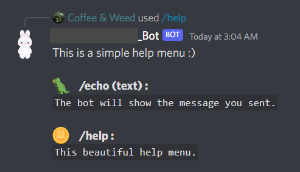
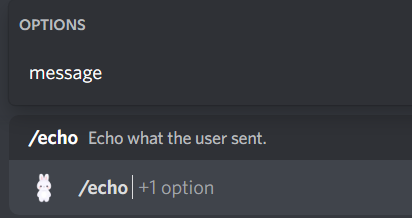
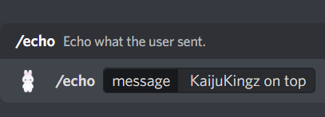
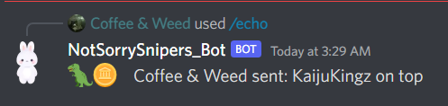

# Basic discord.js example

### Setup 

1. Install node latest version
2. Install discord.js and dependencies: `npm install discord.js @discordjs/rest discord-api-types @discordjs/builders`
3. Set your bot token & client ID in config.json (find it in the [web discord dev panel](https://discord.com/developers/applications/) or enable the dev mod on discord then right click the bot then Copy id)
4. Run the `node register_command.js` to push the bot commands to the guild specified in `config.json`
5. Run the bot with `node index.js`

### Screenshots

Needed permissions on the discord dev dashboard:

Help command

Echo command

