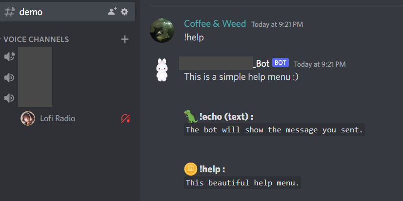

### Discord.py bot example

This is a basic discord bot using discord.py and commands handlers (rather than doing `if` forests on msg.content to filter commands as I saw a lot)

#### Setup

1. Create a discord bot (https://discord.com/developers/applications)
2. Paste the bot token in the script line 14 :
```python
# Set the bot token here
TOKEN 		= ""
```
3. Activate the developper mode on Discord. 
4. Right click a channel and you'll have the ability to copy the channel id. Paste it in the script line19 :
```python
# We can let our bot be accessible in all channel,
# or we can filter the channel in which commands are allowed.
# In this example I want to filter so users can interract with my bot ionly in the #demo channel
channel_cmd = ""
```
5. Install discord.py, python3, and LFG

#### Screenshots

Help menu




Echo command

