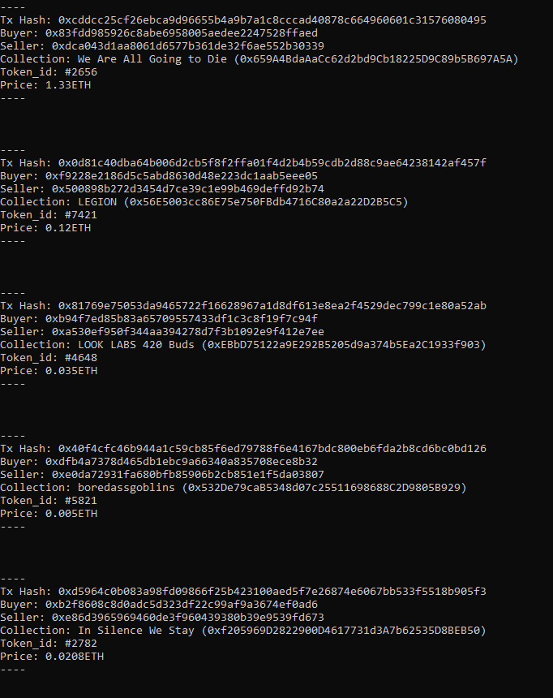

### OpenSea sales

Well, it's a simple script which connects to a RPC provider with HTTP or IPC (**needs edits in the code to setup the provider**) and then prints each ERC721 sale occuring on OpenSea by listening to the Wyvern contract.

Here's a nice image:

